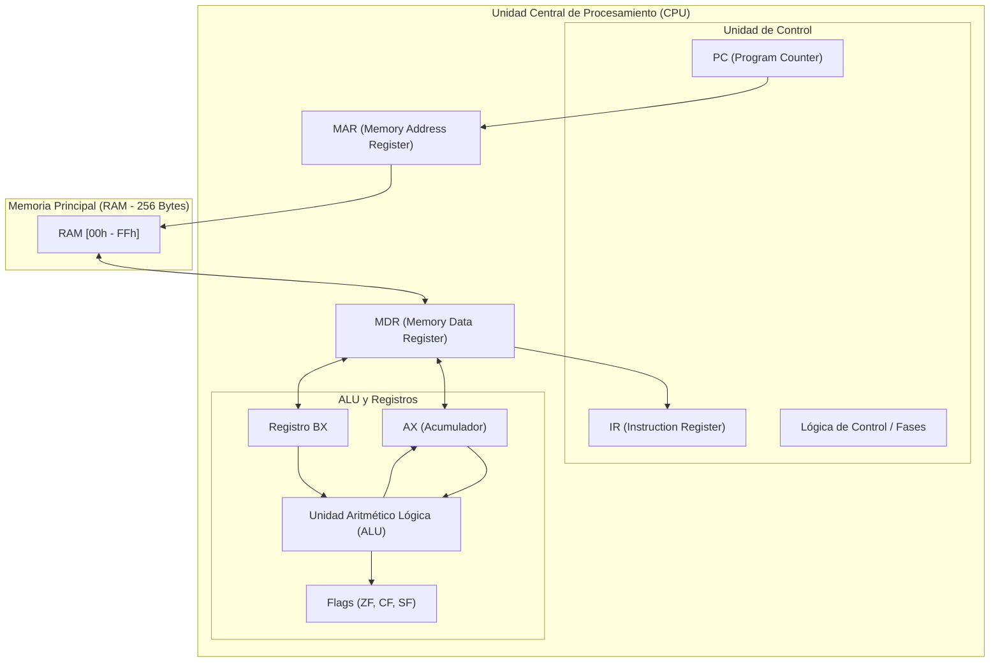

# Simulador de CPU (Arquitectura von Neumann / x86 de 8 bits) y Memoria Principal

**Universidad Católica Boliviana "San Pablo"**  
**Materia:** Arquitectura de Computadoras (SIS-131)  
**Semestre:** 1/2026  
**Docente:** Ing. Paulo César Loayza Carrasco  
**Estudiante:** Cristian Alejandro Carvajal  

---

## 📌 Descripción del Proyecto
Simulador interactivo y visual del ciclo completo de instrucción (**Fetch, Decode, Execute, Store**) y de la gestión de memoria RAM de 8 bits implementado en **Microsoft Excel con Macros VBA** (`.xlsm`).

---

## 🏛️ Arquitectura de Hardware Simulada

### 1. Registros de CPU
* **PC (Program Counter):** 8 bits. Apunta a la siguiente instrucción a ejecutar en memoria.
* **IR (Instruction Register):** 8 bits. Contiene el código de operación (Opcode) y operandos de la instrucción en curso.
* **MAR (Memory Address Register):** 8 bits. Conectado al bus de direcciones de la memoria RAM.
* **MDR / MBR (Memory Data / Buffer Register):** 8 bits. Almacena el dato leído o por escribir en la RAM.
* **AX / AC (Acumulador):** 8 bits. Registro de propósito general para operaciones aritmético-lógicas.
* **BX:** 8 bits. Registro de propósito general y direccionamiento.
* **Banderas de Estado (Flags - 1 bit c/u):**
  * **ZF (Zero Flag):** Activo (1) si el resultado de la ALU es 0.
  * **CF (Carry Flag):** Activo (1) si hubo desbordamiento sin signo.
  * **SF (Sign Flag):** Refleja el bit más significativo (MSB) (1 si es negativo en Ca2).

### 2. Memoria Principal (RAM)
* **Tamaño:** 256 posiciones continuas de 8 bits (`00h` a `FFh`).
* **Organización visual:** Matriz 16×16 con visualización Hexadecimal, Binario y Decimal.
* **Segmentación:** Segmento de Código (instrucciones) y Segmento de Datos (variables y almacenamiento).
* **Primitivas:** `Read(address)` y `Write(address, value)`.

---

## 🔄 Diagrama de Arquitectura (Mermaid)

---

## 📋 Conjunto de Instrucciones (ISA Ensamblador)

| Mnemónico | Sintaxis | Opcode (Hex) | Bytes | Descripción |
|---|---|---|---|---|
| `MOV` | `MOV reg, imm` | `01h` | 2 | Carga valor inmediato en registro |
| `MOV` | `MOV reg, reg` | `02h` | 2 | Copia valor entre registros |
| `LOAD` | `LOAD reg, [dir]` | `03h` | 2 | Lee de dirección RAM a registro |
| `STORE` | `STORE [dir], reg` | `04h` | 2 | Escribe de registro a dirección RAM |
| `ADD` | `ADD reg, imm` / `reg` | `10h` / `11h` | 2 | Suma y actualiza flags (ZF, CF, SF) |
| `SUB` | `SUB reg, imm` / `reg` | `12h` / `13h` | 2 | Resta y actualiza flags (ZF, CF, SF) |
| `INC` | `INC reg` | `14h` | 2 | Incrementa registro en 1 |
| `DEC` | `DEC reg` | `15h` | 2 | Decrementa registro en 1 |
| `CMP` | `CMP reg, imm` / `reg` | `16h` / `17h` | 2 | Compara actualizando flags sin guardar resultado |
| `AND` | `AND reg, imm` / `reg` | `20h` / `21h` | 2 | Operación AND a nivel de bits |
| `OR` | `OR reg, imm` / `reg` | `22h` / `23h` | 2 | Operación OR a nivel de bits |
| `XOR` | `XOR reg, imm` / `reg` | `24h` / `25h` | 2 | Operación XOR a nivel de bits |
| `NOT` | `NOT reg` | `26h` | 2 | Inversión de bits (NOT) |
| `JMP` | `JMP dir` | `30h` | 2 | Salto incondicional a dirección |
| `JZ` | `JZ dir` | `31h` | 2 | Salto si Zero Flag (ZF = 1) |
| `JNZ` | `JNZ dir` | `32h` | 2 | Salto si no Zero Flag (ZF = 0) |
| `HLT` | `HLT` | `FFh` | 1 | Detiene la ejecución del procesador |

---

## 🕹️ Modos de Ejecución
1. **Paso a Paso (Step):** Ejecución micro-operación por micro-operación con resaltado visual del componente activo.
2. **Continuo (Run / Play):** Ejecución automática con velocidad o retardo ajustable.
3. **Reset:** Reinicio total de registros y Program Counter a cero.
4. **Log de Micro-operaciones:** Registro cronológico de eventos en tiempo real.
