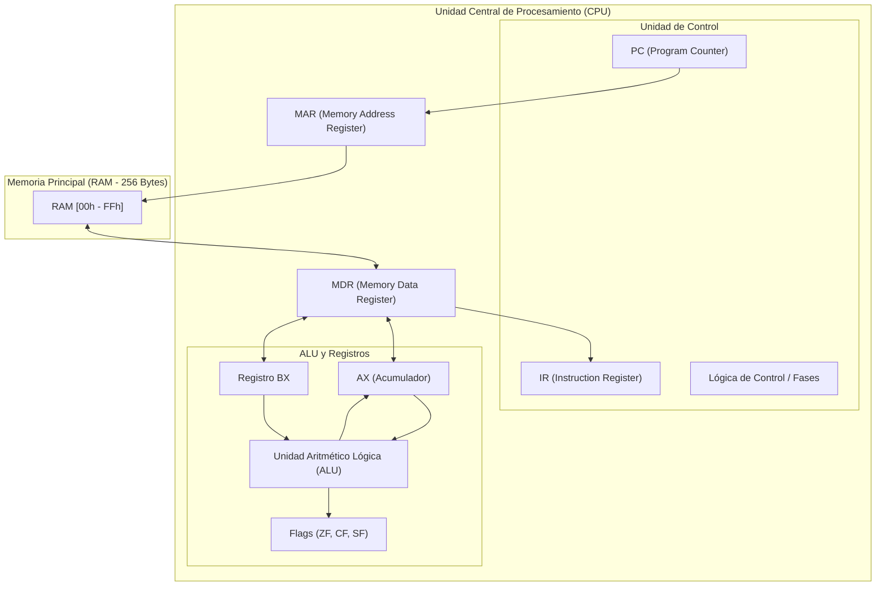

# Simulador de CPU (Arquitectura von Neumann / x86 de 8 bits) y Memoria Principal

**Universidad Católica Boliviana "San Pablo"**  
**Materia:** Arquitectura de Computadoras (SIS-131)  
**Semestre:** 1/2026  
**Docente:** Ing. Paulo César Loayza Carrasco  
**Estudiante:** Cristian Alejandro Carvajal  

---

## 📌 Descripción del Proyecto
Simulador interactivo y visual del ciclo completo de instrucción (**Fetch, Decode, Execute, Store**) y de la gestión de memoria RAM de 8 bits implementado en **Microsoft Excel con Macros VBA** (`.xlsm`).

---

## 🏛️ Arquitectura de Hardware Simulada

### 1. Registros de CPU
* **PC (Program Counter):** 8 bits. Apunta a la siguiente instrucción a ejecutar en memoria.
* **IR (Instruction Register):** 8 bits. Conserva el opcode. Los operandos se guardan por separado en `OperandoDato` o `DireccionEfectiva`, y `MnemonicActual` identifica la operación.
* **MAR (Memory Address Register):** 8 bits. Conectado al bus de direcciones de la memoria RAM.
* **MDR / MBR (Memory Data / Buffer Register):** 8 bits. Almacena el dato leído o por escribir en la RAM.
* **AX / AC (Acumulador):** 8 bits. Registro de propósito general para operaciones aritmético-lógicas.
* **BX:** 8 bits. Registro de propósito general.
* **Banderas de Estado (Flags - 1 bit c/u):**
  * **ZF (Zero Flag):** Activo (1) si el resultado de la ALU es 0.
  * **CF (Carry Flag):** Activo (1) si hubo desbordamiento sin signo.
  * **SF (Sign Flag):** Refleja el bit más significativo (MSB) (1 si es negativo en Ca2).

### 2. Memoria Principal (RAM)
* **Tamaño:** 256 posiciones continuas de 8 bits (`00h` a `FFh`).
* **Organización visual:** Matriz 16×16 con visualización Hexadecimal, Binario y Decimal.
* **Segmentación:** Segmento de Código (instrucciones) y Segmento de Datos (variables y almacenamiento).
* **Primitivas:** `ReadRAM(address)` y `WriteRAM(address, value)` en `ModuloMemoria.bas`.

---

## 🔄 Diagrama de Arquitectura (Mermaid)

```mermaid
graph TD
    subgraph CPU ["Unidad Central de Procesamiento (CPU)"]
        subgraph UC ["Unidad de Control"]
            PC["PC (Program Counter)"]
            IR["IR (Instruction Register)"]
            ControlLogic["Lógica de Control / Fases"]
        end
        subgraph ALU_Module ["ALU y Registros"]
            AX["AX (Acumulador)"]
            BX["Registro BX"]
            ALU["Unidad Aritmético Lógica (ALU)"]
            Flags["Flags (ZF, CF, SF)"]
        end
        MAR["MAR (Memory Address Register)"]
        MDR["MDR (Memory Data Register)"]
    end

    subgraph RAM_Module ["Memoria Principal (RAM - 256 Bytes)"]
        RAM["RAM [00h - FFh]"]
    end

    PC --> MAR
    MAR --> RAM
    RAM <--> MDR
    MDR --> IR
    MDR <--> AX
    MDR <--> BX
    AX --> ALU
    BX --> ALU
    ALU --> Flags
    ALU --> AX
```

---

## Conjunto de instrucciones (ISA)

La siguiente tabla describe el decodificador actual de `src/ModuloCiclo.bas`. Los opcodes son propios del simulador educativo; no son la codificación binaria de un procesador x86 real. `imm` y `dir` ocupan un byte (00h–FFh) después del opcode. En las operaciones entre registros, los registros están determinados por el opcode.

| Opcode | Instrucción | Bytes | Descripción |
|---|---|---|---|
| `01h` | `MOV AX, imm` | 2 | Carga el inmediato en AX |
| `02h` | `MOV BX, imm` | 2 | Carga el inmediato en BX |
| `03h` | `MOV AX, BX` | 1 | Copia BX en AX |
| `04h` | `MOV BX, AX` | 1 | Copia AX en BX |
| `05h` | `LOAD AX, [dir]` | 2 | Lee RAM[dir] hacia AX |
| `06h` | `LOAD BX, [dir]` | 2 | Lee RAM[dir] hacia BX |
| `07h` | `STORE [dir], AX` | 2 | Escribe AX en RAM[dir] |
| `08h` | `STORE [dir], BX` | 2 | Escribe BX en RAM[dir] |
| `10h` | `ADD AX, imm` | 2 | Suma el inmediato a AX y actualiza banderas |
| `11h` | `ADD AX, BX` | 1 | Suma BX a AX y actualiza banderas |
| `12h` | `SUB AX, imm` | 2 | Resta el inmediato de AX y actualiza banderas |
| `13h` | `SUB AX, BX` | 1 | Resta BX de AX y actualiza banderas |
| `14h` | `INC AX` | 1 | Incrementa AX |
| `15h` | `INC BX` | 1 | Incrementa BX |
| `16h` | `DEC AX` | 1 | Decrementa AX |
| `17h` | `DEC BX` | 1 | Decrementa BX |
| `18h` | `CMP AX, imm` | 2 | Compara AX con inmediato sin escribir AX |
| `19h` | `CMP AX, BX` | 1 | Compara AX con BX sin escribir los registros |
| `20h` | `AND AX, imm` | 2 | AND entre AX e inmediato |
| `21h` | `AND AX, BX` | 1 | AND entre AX y BX |
| `22h` | `OR AX, imm` | 2 | OR entre AX e inmediato |
| `23h` | `OR AX, BX` | 1 | OR entre AX y BX |
| `24h` | `XOR AX, imm` | 2 | XOR entre AX e inmediato |
| `25h` | `XOR AX, BX` | 1 | XOR entre AX y BX |
| `26h` | `NOT AX` | 1 | Invierte los ocho bits de AX |
| `30h` | `JMP dir` | 2 | Salta a dir |
| `31h` | `JZ dir` | 2 | Salta a dir si ZF=1 |
| `32h` | `JNZ dir` | 2 | Salta a dir si ZF=0 |
| `FFh` | `HLT` | 1 | Detiene la ejecución |

Las variantes aritméticas con BX como destino, fuera de INC y DEC, no están implementadas en el decodificador actual. La cobertura del repertorio requerido se revisa en #5; las pruebas de banderas se siguen en #11.

---

## 🕹️ Modos de Ejecución
1. **Paso a Paso (Step):** Avanza una fase del ciclo por pulsación; cada fase agrupa sus microoperaciones y resalta los componentes correspondientes.
2. **Continuo (Run / Play):** Ejecución automática con velocidad o retardo ajustable.
3. **Reset:** Reinicio total de registros y Program Counter a cero.
4. **Log de Micro-operaciones:** Registro cronológico de eventos en tiempo real.

## Gestión del proyecto

[Tablero Kanban del Parcial 1](https://github.com/users/cristiancarvajal22/projects/4)

- **Backlog:** tarea pendiente de iniciar o verificar.
- **Active:** trabajo en curso, con un alcance concreto.
- **Done:** criterios de aceptación comprobados y evidencia registrada en la issue.

Los commits se organizan por cambios concretos, con mensajes `feat:`, `fix:`, `docs:` o `refactor:` y referencias a la tarea relacionada. Las pruebas se registran antes de cerrar una tarea.

El repositorio contiene una implementación inicial; la validación del libro en Excel, las correcciones pendientes y la documentación de uso se siguen en las issues abiertas.
