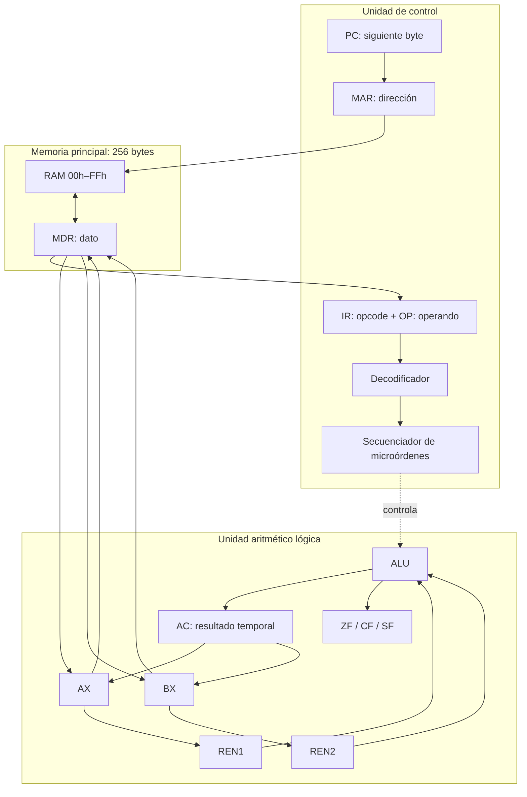

# Simulador CPU de 8 bits — Google Sheets

Universidad Católica Boliviana «San Pablo» · Arquitectura de Computadoras (SIS-131). Estudiante: Cristian Alejandro Carvajal.

Implementación de la opción B: Google Sheets y JavaScript / Apps Script. La interfaz usa celdas, figuras nativas y controles en la hoja. El motor procesa cada microoperación; no calcula el resultado de antemano para simular una animación.

- [Abrir el simulador](https://docs.google.com/spreadsheets/d/1Bs-0LmqG8ZuL2jXGjhYFdoQS2lfN9oymlDNMpPjKLvo/edit)
- [Tablero del proyecto](https://github.com/users/cristiancarvajal22/projects/4)
- [Código vinculado a la hoja](https://script.google.com/u/0/home/projects/1OXoAnWaQUTTjx1Rz92JwH1jiB4Q6ZIPlROSrrarl64gbIw6fS-1ZcOgI/edit)

## Uso

1. Abrir la hoja en un navegador de escritorio con permiso de edición. Recargar si no aparece el menú **Simulador CPU**.
2. En **Operación**, elegir una instrucción y escribir A, B e inmediato como enteros decimales entre 0 y 255. El inmediato solo se utiliza en variantes que dicen **imm**.
3. Elegir **Simulador CPU → Cargar operación elegida**. El programa se copia en **Programa** y en la RAM; los registros y el log se reinician.
4. En **Diagrama**, **PASO** realiza una sola microoperación. **EJECUTAR** avanza automáticamente. El indicador viaja desde el componente origen al destino; se resaltan los componentes activos y se muestra el dato en hexadecimal, decimal y binario.
5. **PAUSAR** se aplica al terminar la microoperación en curso. **RESET** pone registros, PC y flags a cero y conserva la RAM. **CARGAR** vuelve a leer los 256 bytes de **Programa!B7:B262** y descarta modificaciones de la RAM ejecutada.
6. El retardo entre pasos se ajusta en **Diagrama!AQ4** (100–2000 ms). Se suma al tiempo de actualización de Google Sheets. Por el límite de ejecución del servicio, RUN hace una pausa automática después de cuatro minutos; puede reanudarse con EJECUTAR sin perder estado.
7. **Memoria** muestra RAM en una matriz 16×16. Azul: código 00h–7Fh; verde: datos 80h–FFh. Es una separación visual, no protección contra escritura. Para inspeccionar cualquier dirección, escribir su HEX en C25 y usar **Leer memoria**. F25, I25 y L25 muestran HEX, DEC y BIN. Para escribir, pausar, introducir el byte HEX en F25 y usar **Escribir memoria**.
8. **Registro** conserva la traza cronológica. **ISA** muestra el repertorio. El inspector de registros en **Memoria!U5:X15** muestra sus tres bases.

Los controles también están disponibles en el menú. Los dibujos con función asignada requieren navegador de escritorio; en la aplicación móvil de Sheets no ejecutan Apps Script. Las animaciones son transferencias discretas sincronizadas con cada microoperación; su fluidez depende de Sheets y de la conexión.

### Qué datos recibe la ALU

Para ADD AX,BX, A se lee desde RAM[80h] hacia AX y B desde RAM[81h] hacia BX. AX pasa a REN1 y BX a REN2. La ALU calcula REN1 + REN2, guarda en AC y actualiza flags. Después AC pasa a AX. Una instrucción STORE posterior escribe AX en RAM[82h]. Cada LOAD, ADD y STORE tiene su propio FETCH, DECODE, EXECUTE y STORE.

SUB realiza la resta. CMP usa la misma resta pero no escribe el resultado en AX/BX. INC y DEC usan una constante interna 1; NOT solo necesita REN1 (REN2 se pone en 0 y se ignora). MOV, LOAD, STORE y los saltos no modifican flags.

Los ejemplos del selector guardan AX final en 82h y BX final en 83h. LOAD utiliza 80h como dirección de prueba y STORE utiliza 84h. En JMP/JZ/JNZ se añade CMP AX,BX y se salta sobre MOV AX,EEh: los datos A y B permiten observar ambas condiciones. HLT detiene el programa antes del almacenamiento final.

## Arquitectura

```mermaid
flowchart TB
  subgraph UC[Unidad de control]
    PC[PC: siguiente byte] --> MAR
    IR[IR: opcode + OP: operando] --> DEC[Decodificador]
    DEC --> SEC[Secuenciador de microórdenes]
  end
  subgraph UAL[Unidad aritmético lógica]
    AX[AX] --> REN1
    BX[BX] --> REN2
    REN1 --> ALU
    REN2 --> ALU
    ALU --> AC[AC: resultado temporal]
    ALU --> FLAGS[ZF / CF / SF]
    AC --> AX
    AC --> BX
  end
  subgraph MEM[Memoria principal: 256 bytes]
    MAR[MAR: dirección] --> RAM[RAM 00h–FFh]
    RAM <--> MDR[MDR: dato]
  end
  MDR --> IR
  MDR --> AX
  MDR --> BX
  AX --> MDR
  BX --> MDR
  SEC -. controla .-> ALU
```

Todos los registros de datos y direcciones son de 8 bits. IR conserva el opcode y OP el byte operando, visibles por separado como los dos campos de la instrucción. AC es un registro temporal de la ALU; AX y BX son los registros de propósito general. Esta es una ISA didáctica propia con nombres inspirados en x86, no una emulación binaria de x86.

**Flags:** ZF=1 para resultado cero; SF es el bit 7 (interpretación con signo en complemento a dos); CF=1 por acarreo en suma o préstamo en resta. INC y DEC también actualizan CF. Las operaciones lógicas ponen CF=0. El resultado se reduce módulo 256. CMP actualiza flags conservando AX/BX. PC también vuelve a 00h después de FFh.

### Ciclo

1. **FETCH:** PC → MAR; RAM[MAR] → MDR; MDR → IR; PC ← PC+1.
2. **DECODE:** interpretar IR y, si existe, leer el segundo byte por MAR/MDR hacia OP; incrementar PC.
3. **EXECUTE:** preparar entradas de ALU, leer datos o evaluar la condición de salto.
4. **STORE:** escribir AC en el registro destino o MDR en RAM[MAR]. CMP, saltos y HLT tienen un cierre explícito sin escritura de datos.

Un opcode desconocido detiene el motor e indica dirección y byte. Las entradas inválidas se rechazan antes de modificar el programa. Un bloqueo de documento evita que dos ejecuciones escriban el estado a la vez; PAUSE y LOAD cancelan el identificador de la ejecución anterior.

## ISA completa

El primer byte es el opcode; en instrucciones de dos bytes, el segundo contiene el inmediato o la dirección. AX/BX ya están codificados en el opcode. Todos los códigos de la tabla son hexadecimales.

| Opcode | Bytes | Instrucción | Efecto |
|---|---:|---|---|
| 01 | 2 | `MOV AX,imm` | Copia el origen al registro; conserva flags. |
| 02 | 2 | `MOV BX,imm` | Copia el origen al registro; conserva flags. |
| 03 | 1 | `MOV AX,BX` | Copia el origen al registro; conserva flags. |
| 04 | 1 | `MOV BX,AX` | Copia el origen al registro; conserva flags. |
| 05 | 2 | `LOAD AX,[dir]` | Lee RAM[dir] mediante MAR y MDR. |
| 06 | 2 | `LOAD BX,[dir]` | Lee RAM[dir] mediante MAR y MDR. |
| 07 | 2 | `STORE [dir],AX` | Escribe el registro en RAM[dir] mediante MAR y MDR. |
| 08 | 2 | `STORE [dir],BX` | Escribe el registro en RAM[dir] mediante MAR y MDR. |
| 10 | 2 | `ADD AX,imm` | Suma de 8 bits; actualiza ZF, CF, SF. |
| 11 | 1 | `ADD AX,BX` | Suma de 8 bits; actualiza ZF, CF, SF. |
| 12 | 2 | `SUB AX,imm` | Resta de 8 bits; CF indica préstamo. |
| 13 | 1 | `SUB AX,BX` | Resta de 8 bits; CF indica préstamo. |
| 14 | 1 | `INC AX` | Incrementa en uno; actualiza flags. |
| 15 | 1 | `INC BX` | Incrementa en uno; actualiza flags. |
| 16 | 1 | `DEC AX` | Decrementa en uno; actualiza flags. |
| 17 | 1 | `DEC BX` | Decrementa en uno; actualiza flags. |
| 18 | 2 | `CMP AX,imm` | Resta para actualizar flags; conserva los registros. |
| 19 | 1 | `CMP AX,BX` | Resta para actualizar flags; conserva los registros. |
| 20 | 2 | `AND AX,imm` | AND bit a bit; CF=0. |
| 21 | 1 | `AND AX,BX` | AND bit a bit; CF=0. |
| 22 | 2 | `OR AX,imm` | OR bit a bit; CF=0. |
| 23 | 1 | `OR AX,BX` | OR bit a bit; CF=0. |
| 24 | 2 | `XOR AX,imm` | XOR bit a bit; CF=0. |
| 25 | 1 | `XOR AX,BX` | XOR bit a bit; CF=0. |
| 26 | 1 | `NOT AX` | Complemento de cada bit; CF=0. |
| 30 | 2 | `JMP dir` | Salto incondicional a dir. |
| 31 | 2 | `JZ dir` | Salta cuando ZF=1. |
| 32 | 2 | `JNZ dir` | Salta cuando ZF=0. |
| 40 | 2 | `ADD BX,imm` | Suma de 8 bits; actualiza ZF, CF, SF. |
| 41 | 1 | `ADD BX,AX` | Suma de 8 bits; actualiza ZF, CF, SF. |
| 42 | 2 | `SUB BX,imm` | Resta de 8 bits; CF indica préstamo. |
| 43 | 1 | `SUB BX,AX` | Resta de 8 bits; CF indica préstamo. |
| 44 | 2 | `CMP BX,imm` | Resta para actualizar flags; conserva los registros. |
| 45 | 1 | `CMP BX,AX` | Resta para actualizar flags; conserva los registros. |
| 46 | 2 | `AND BX,imm` | AND bit a bit; CF=0. |
| 47 | 1 | `AND BX,AX` | AND bit a bit; CF=0. |
| 48 | 2 | `OR BX,imm` | OR bit a bit; CF=0. |
| 49 | 1 | `OR BX,AX` | OR bit a bit; CF=0. |
| 4A | 2 | `XOR BX,imm` | XOR bit a bit; CF=0. |
| 4B | 1 | `XOR BX,AX` | XOR bit a bit; CF=0. |
| 4C | 1 | `NOT BX` | Complemento de cada bit; CF=0. |
| FF | 1 | `HLT` | Detiene el reloj al completar STORE. |

## Programa demostrativo: multiplicación por sumas sucesivas

Usar **Simulador CPU → Cargar demo: multiplicación**. Inicialmente RAM[80h]=05h, RAM[81h]=03h y RAM[82h]=00h. El resultado es 5×3=15=0Fh, almacenado en RAM[82h]. El contador de RAM[81h] termina en cero.

| Dirección | Bytes | Instrucción |
|---|---|---|
| 00 | 05 81 | LOAD AX,[81h] |
| 02 | 18 00 | CMP AX,00h |
| 04 | 31 19 | JZ 19h |
| 06 | 06 80 | LOAD BX,[80h] |
| 08 | 05 82 | LOAD AX,[82h] |
| 0A | 11 | ADD AX,BX |
| 0B | 07 82 | STORE [82h],AX |
| 0D | 05 81 | LOAD AX,[81h] |
| 0F | 16 | DEC AX |
| 10 | 07 81 | STORE [81h],AX |
| 12 | 18 00 | CMP AX,00h |
| 14 | 32 08 | JNZ 08h |
| 16 | 30 19 | JMP 19h |
| 18 | 00 | Byte de relleno; no se ejecuta |
| 19 | FF | HLT |

Traza de las escrituras en memoria obtenida del motor (registros/direcciones/valores en HEX; flags en orden ZF,CF,SF):

| Paso | PC | AX | BX | Dirección escrita | Valor | ZCS |
|---:|---|---|---|---|---|---|
| 81 | 0D | 05 | 05 | 82 | 05 | 000 |
| 114 | 12 | 02 | 05 | 81 | 02 | 000 |
| 171 | 0D | 0A | 05 | 82 | 0A | 000 |
| 204 | 12 | 01 | 05 | 81 | 01 | 000 |
| 261 | 0D | 0F | 05 | 82 | 0F | 000 |
| 294 | 12 | 00 | 05 | 81 | 00 | 100 |

El procesador se detiene en el paso **336**, con PC=1Ah, IR=FFh, AX=00h, BX=05h y ZF=1. AX contiene el contador final; el producto se consulta en RAM[82h]. Para repetir desde los datos iniciales usar CARGAR, no RESET, porque RESET conserva la RAM modificada.

## Código y reproducción

- **src/Cpu.gs:** RAM, registros, ISA, ALU y secuenciación; independiente de Google Sheets.
- **src/Ejemplos.gs:** programas cortos generados por el selector.
- **src/Hoja.gs:** controles, validación de entradas, representación nativa, animación y log.
- **src/appsscript.json:** manifiesto V8 con acceso a la hoja actual.
- **tests/cpu.test.cjs:** pruebas del motor y de cada ejemplo seleccionable.

La hoja enlazada incluye las figuras editables y el script vinculado. Para obtener otra instancia completa, crear una copia de esa hoja. Para actualizar su código, pegar Cpu.gs, Ejemplos.gs y Hoja.gs en archivos del proyecto vinculado (o concatenarlos en Código.gs), guardar y recargar la hoja. No duplicar simultáneamente ambas formas de instalación. Los dibujos tienen asignadas las funciones paso, ejecutar, pausar, reiniciar y cargarPrograma. El indicador se identifica con mostrarTransferencia y la figura ALU con mostrarALU.

Pruebas locales desde la raíz del repositorio: **node tests/cpu.test.cjs**. Incluyen 196608 combinaciones de ADD/SUB/CMP, los 42 opcodes, límites de memoria, wrap de PC, HLT, cinco variantes del programa de multiplicación y 126 ejemplos del selector con comprobación de registros, banderas y saltos.

## Gestión

[GitHub Projects](https://github.com/users/cristiancarvajal22/projects/4) conserva Backlog, Active y Done. Los cambios se registran por incremento real (motor, conexión con la hoja, ejemplos, simplificación visual y documentación). Las tareas no se cierran automáticamente al publicar código; su revisión se gestiona en el tablero.
